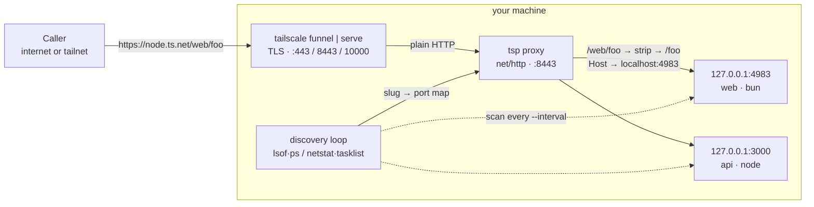

import { Callout } from "nextra/components";

# tailscale-proxy

Share all your local dev servers through one stable Tailscale `*.ts.net` URL — a
self-hosted ngrok alternative. Grab the **app**, or run **one command**.

## ⬇️ Download the desktop app

<div className="dl-grid">
  <a className="dl-btn" href="https://github.com/meabed/tailscale-proxy/releases/download/desktop-latest/Tailscale-Proxy-macOS.dmg">
    <svg viewBox="0 0 24 24" fill="currentColor"><path d="M16.4 12.8c0-2.2 1.8-3.3 1.9-3.3-1-1.5-2.6-1.7-3.2-1.7-1.4-.1-2.6.8-3.3.8s-1.7-.8-2.9-.8c-1.5 0-2.9.9-3.6 2.2-1.6 2.7-.4 6.7 1.1 8.9.7 1.1 1.6 2.3 2.7 2.2 1.1 0 1.5-.7 2.8-.7s1.6.7 2.8.7c1.2 0 1.9-1.1 2.6-2.1.8-1.2 1.2-2.4 1.2-2.4s-2.3-.9-2.4-3.7zM14.3 5.9c.6-.7 1-1.7.9-2.7-.9 0-1.9.6-2.5 1.3-.6.6-1 1.6-.9 2.6 1 .1 2-.5 2.5-1.2z"/></svg>
    <span><b>macOS</b> — Apple Silicon &amp; Intel<span>.dmg</span></span>
  </a>
  <a className="dl-btn" href="https://github.com/meabed/tailscale-proxy/releases/download/desktop-latest/Tailscale-Proxy-Windows.zip">
    <svg viewBox="0 0 24 24" fill="currentColor"><path d="M3 5.3 10.4 4.3v7.2H3zM10.4 12.5v7.2L3 18.7v-6.2zM11.4 4.1 21 2.7v8.8h-9.6zM21 12.5v8.8l-9.6-1.4v-7.4z"/></svg>
    <span><b>Windows</b> — 64-bit<span>.zip</span></span>
  </a>
  <a className="dl-btn" href="https://github.com/meabed/tailscale-proxy/releases/download/desktop-latest/Tailscale-Proxy-Linux.tar.gz">
    <svg viewBox="0 0 24 24" fill="currentColor"><path d="M12 2c-1.7 0-3 1.6-3 3.6 0 1 .1 1.9-.5 2.9-.7 1.1-1.8 2-2.3 3.6-.4 1.3-.2 2.3.1 3.3-.4.3-.7.8-.5 1.5.1.6 0 .9-.2 1.2-.4.6-.2 1.3.6 1.5.7.2 1.6.4 2.5.9.6.3 1.3.3 1.7-.1.5.1 1 .2 1.6.2s1.1-.1 1.6-.2c.4.4 1.1.4 1.7.1.9-.5 1.8-.7 2.5-.9.8-.2 1-.9.6-1.5-.2-.3-.3-.6-.2-1.2.2-.7-.1-1.2-.5-1.5.3-1 .5-2 .1-3.3-.5-1.6-1.6-2.5-2.3-3.6-.6-1-.5-1.9-.5-2.9C15 3.6 13.7 2 12 2zm-1.3 4.2c.4 0 .7.4.7.9s-.3.9-.7.9-.7-.4-.7-.9.3-.9.7-.9zm2.6 0c.4 0 .7.4.7.9s-.3.9-.7.9-.7-.4-.7-.9.3-.9.7-.9z"/></svg>
    <span><b>Linux</b> — 64-bit<span>.tar.gz</span></span>
  </a>
</div>

A native menu-bar app — no terminal needed. [Screenshots, install steps & all releases →](/desktop)

## ⚡ Or one command in the terminal

```bash
npx tailscale-proxy                   # discovers your dev servers + shares them via Tailscale
brew install meabed/tap/tsp && tsp    # or install the binary
```

First time? `npx tailscale-proxy doctor` checks your setup, or follow the 4-step
[Installation](/installation) guide.

---

An open-source, **self-hosted [ngrok](https://ngrok.com) alternative** built on
[Tailscale](https://tailscale.com): discover your local dev servers by **port**
and expose them through a **single Tailscale entry** — privately
([Serve](https://tailscale.com/kb/1312/serve), tailnet-only) or publicly
([Funnel](https://tailscale.com/kb/1223/funnel)) — routed by **project name**.

<Callout type="info">
  **Why not ngrok?** Your traffic runs over your own Tailscale tunnel on a stable
  `*.ts.net` URL — no third-party tunnel, no per-session random URLs, no request
  rate limits or paywalls. Share **many** dev servers through **one** hostname,
  and discovery is automatic — no `ngrok http 3000` per port.
</Callout>

No per-app wiring: just run your servers (`node`, `bun`, `deno`, `python`, `php`,
`ruby`, `go`, `java`, …) and `tsp` finds the ones listening in a port range,
derives a path slug from each project's folder, and routes to them under one
hostname:



`tsp` strips the first path segment (the project name) and forwards the rest to
that project's local port — so `…/web/foo` → `127.0.0.1:4983/foo`.

<Callout type="info">
  It re-scans every few seconds (so servers that come and go are picked up),
  keeps a service for a few scans before de-registering (no flapping on
  restarts), streams SSE, and proxies WebSocket upgrades. Zero runtime
  dependencies — one small Go binary.
</Callout>

## Try it in 30 seconds

```bash
# Start a couple of dev servers (each in its own project folder)
cd ~/sites/portfolio && npx serve -l 3000
cd ~/apps/web        && npx next dev -p 4000

# Share them through one Tailscale URL
npx tailscale-proxy doctor
npx tailscale-proxy
```

```
Services:
  https://bigfoot.tail-scale.ts.net/portfolio/  →  127.0.0.1:3000
  https://bigfoot.tail-scale.ts.net/web/        →  127.0.0.1:4000
```

## Why

- **One hostname, many apps.** Funnel only exposes a single hostname; `tsp` puts
  a path-routing proxy behind it so every dev server is reachable.
- **Zero config per app.** Run your server normally; `tsp` discovers it by port.
- **Looks like localhost.** The app receives `Host: localhost:<port>` (so CORS,
  cookies, and host-allowlists match) — with `--forward-host` when you need the
  public URL.
- **Private or public.** `--private` for tailnet-only Serve; Funnel by default.

Head to [Installation](/installation) or [Getting started](/getting-started).
